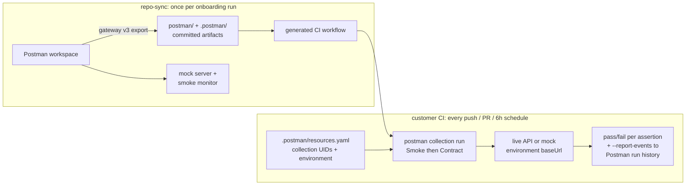

# Postman Onboarding: Repo Sync

[](https://github.com/postman-cs/postman-repo-sync-action/actions/workflows/ci.yml) [](https://github.com/postman-cs/postman-repo-sync-action/releases) [](https://www.npmjs.com/package/@postman-cse/onboarding-repo-sync) [](LICENSE)

Exports Postman [collections](https://learning.postman.com/docs/use/use-collections/collections-schemas/) and [environments](https://learning.postman.com/docs/use/send-requests/variables/managing-environments/) into your repository and wires CI, [mock servers](https://learning.postman.com/docs/design-apis/mock-apis/set-up-mock-servers/), and [monitors](https://learning.postman.com/docs/monitoring-your-api/setting-up-monitor/) around them.

Part of the [Postman API Onboarding suite](https://github.com/postman-cs/postman-api-onboarding-action); the composite action's README has the full action-picker table.

- [Usage](#usage)
- [Examples](#examples)
- [Inputs](#inputs) / [Outputs](#outputs)
- [How it works](#how-it-works)

## Usage

```yaml
jobs:
  repo-sync:
    runs-on: ubuntu-latest
    permissions:
      contents: write
      actions: write
    steps:
      - uses: actions/checkout@v5

      - id: postman-auth
        uses: postman-cs/postman-resolve-service-token-action@v2
        with:
          postman-region: us
          postman-api-key: ${{ secrets.POSTMAN_API_KEY }}

      - uses: postman-cs/postman-repo-sync-action@v2
        with:
          project-name: core-payments
          postman-region: us
          postman-api-key: ${{ secrets.POSTMAN_API_KEY }}
          postman-access-token: ${{ steps.postman-auth.outputs.token }}
          team-id: ${{ steps.postman-auth.outputs.team-id }}
          github-token: ${{ secrets.GITHUB_TOKEN }}
```

`actions/checkout` must run before this action. `project-name` is the only schema-required input. A useful sync also needs a Postman API key or a service-token step that can mint one, plus workspace and collection IDs from inputs or `.postman/resources.yaml`.

The example permissions let `GITHUB_TOKEN` commit generated artifacts and update the generated workflow file. `contents: write` is required for `repo-write-mode: commit-only` and `commit-and-push`. `actions: write` is required when `generate-ci-workflow` writes under `.github/workflows/`. Repository secret persistence, such as a generated `POSTMAN_API_KEY` or mTLS certificate secret, needs `gh-fallback-token` with permission to manage Actions secrets.

`postman-region` controls the Postman public API host and generated [Postman CLI login region](https://learning.postman.com/docs/postman-cli/postman-cli-auth/). Use `us` for `https://api.getpostman.com` and `eu` for `https://api.eu.postman.com` when the team uses [EU data residency](https://learning.postman.com/docs/administration/enterprise/about-eu-data-residency/).

## Examples

### Full sync with workspace assets

```yaml
- uses: postman-cs/postman-repo-sync-action@v2
  with:
    project-name: core-payments
    workspace-id: ws-123
    baseline-collection-id: col-baseline
    smoke-collection-id: col-smoke
    contract-collection-id: col-contract
    postman-region: us
    environments-json: '["prod","stage"]'
    env-runtime-urls-json: '{"prod":"https://api.example.com","stage":"https://stage-api.example.com"}'
    postman-api-key: ${{ secrets.POSTMAN_API_KEY }}
    postman-access-token: ${{ steps.postman-auth.outputs.token }}
    team-id: ${{ steps.postman-auth.outputs.team-id }}
    github-token: ${{ secrets.GITHUB_TOKEN }}
```

`postman-access-token` is required: every asset operation (environment create/get/update, collection read, mock, monitor) plus workspace-to-repository linking and system environment association runs through the access-token gateway. Use `postman-resolve-service-token-action` to mint it at runtime from a [Postman service account](https://learning.postman.com/docs/administration/service-accounts/) PMAK. Without it the action fails fast — the PMAK is not an asset-routing fallback; it only mints/re-mints the access token, powers the generated CI workflow's `postman login --with-api-key`, and mints the CI `POSTMAN_API_KEY` secret. See [docs/credentials.md](docs/credentials.md).

### Disable CI workflow generation

For existing repositories that already own their CI workflow, disable workflow generation:

```yaml
with:
  generate-ci-workflow: false
```

### Custom CI workflow path

Write the generated workflow somewhere other than `.github/workflows/ci.yml`:

```yaml
with:
  ci-workflow-path: .github/workflows/postman-sync.yml
```

### Commit-only mode for protected branches

If branch protection requires pull requests, run on a temporary branch with commit-only writes, then create the PR in a later workflow step. Use this for customer-managed PR workflows.

```yaml
with:
  repo-write-mode: commit-only
```

`repo-write-mode` options:

| Mode | Behavior |
| --- | --- |
| `commit-and-push` | Commit generated files and push them back to the current checked out ref. |
| `commit-only` | Commit generated files without pushing. |
| `none` | Write files in the workspace only. |

### Reuse an existing mock server and monitor

Pass `mock-url` or `monitor-id` to validate and reuse existing [mock servers](https://learning.postman.com/docs/design-apis/mock-apis/set-up-mock-servers/) or [monitors](https://learning.postman.com/docs/monitoring-your-api/setting-up-monitor/) instead of creating new ones:

```yaml
with:
  mock-url: https://abc123.mock.pstmn.io
  monitor-id: 1e2f3a4b-monitor-id
```

### mTLS certificates for Postman CLI runs

The generated CI workflow can run [Postman CLI collection runs](https://learning.postman.com/docs/postman-cli/postman-cli-collections/) with client certificates. Pass the cert material as inputs; when a GitHub token and repository context are available, the action persists them as repository secrets (`POSTMAN_SSL_CLIENT_CERT_B64`, `POSTMAN_SSL_CLIENT_KEY_B64`, `POSTMAN_SSL_CLIENT_PASSPHRASE`, `POSTMAN_SSL_EXTRA_CA_CERTS_B64`) for the generated workflow:

```yaml
with:
  ssl-client-cert: ${{ secrets.POSTMAN_SSL_CLIENT_CERT_B64 }}
  ssl-client-key: ${{ secrets.POSTMAN_SSL_CLIENT_KEY_B64 }}
  ssl-client-passphrase: ${{ secrets.POSTMAN_SSL_CLIENT_PASSPHRASE }}
```

## Inputs

<!-- inputs-table:start -->
| Name | Description | Required | Default |
| --- | --- | --- | --- |
| `generate-ci-workflow` | Whether to generate the CI workflow file | no | `true` |
| `ci-workflow-path` | Path to write the generated CI workflow file. Defaults to azure-pipelines.yml for Azure DevOps, .github/workflows/ci.yml otherwise. | no |  |
| `project-name` | Service project name used for environment, mock, and monitor naming. | yes |  |
| `workspace-id` | Postman workspace ID used for workspace-link and export metadata. | no |  |
| `baseline-collection-id` | Baseline collection ID used for exported artifacts and mock server creation. | no |  |
| `monitor-type` | Type of monitor to create ("cloud" or "cli"). "cli" will skip cloud monitor creation and rely on the CI workflow. | no | `cloud` |
| `smoke-collection-id` | Smoke collection ID used for monitor creation. | no |  |
| `contract-collection-id` | Contract collection ID used for exported artifacts. | no |  |
| `collection-sync-mode` | Collection sync lifecycle mode (refresh or version). | no | `refresh` |
| `spec-sync-mode` | Spec sync lifecycle mode (update or version). | no | `update` |
| `release-label` | Optional release label used for versioned naming. | no |  |
| `monitor-id` | Existing smoke monitor ID. When set, the action validates and reuses this monitor instead of creating a new one. | no |  |
| `mock-url` | Existing mock server URL. When set, the action validates and reuses this mock instead of creating a new one. | no |  |
| `monitor-cron` | Cron expression for monitor scheduling (e.g. '0 */6 * * *'). When empty, the monitor is created disabled and triggered to run once per workflow invocation (and once on every subsequent run). | no | `""` |
| `environments-json` | JSON array of environment slugs to create or update. | no | `["prod"]` |
| `git-provider` | Git provider override ('github', 'gitlab', 'bitbucket', 'azure-devops'). Auto-detected from environment when omitted. | no |  |
| `ado-token` | Azure DevOps personal access token or system token used to push commits in Azure Pipelines. Defaults to SYSTEM_ACCESSTOKEN when available. | no |  |
| `repo-url` | Explicit repository URL (GitHub, GitLab, or Azure DevOps). Defaults to the URL inferred from runner environment when omitted. | no |  |
| `workspace-link-enabled` | Enable workspace linking. | no | `true` |
| `environment-sync-enabled` | Enable association of Postman environments to system environments. | no | `true` |
| `system-env-map-json` | JSON map of environment slug to system environment id. | no | `{}` |
| `environment-uids-json` | JSON map of environment slug to Postman environment uid. | no | `{}` |
| `env-runtime-urls-json` | JSON map of environment slug to runtime base URL. | no | `{}` |
| `artifact-dir` | Root directory for exported Postman artifacts. | no | `postman` |
| `repo-write-mode` | Repo mutation mode for generated artifacts and workflow files. | no | `commit-and-push` |
| `current-ref` | Explicit ref override for push-changes when the checkout is detached. | no |  |
| `committer-name` | Git committer name for sync commits. | no | `Postman` |
| `committer-email` | Git committer email for sync commits. | no | `support@postman.com` |
| `postman-api-key` | Postman API key (PMAK). Used only to mint/re-mint the access token (via postman-resolve-service-token-action) and for the Postman CLI spec-lint login. Asset operations (environments, collections, mocks, monitors) run on the access-token gateway and do not use the PMAK. Optional when a valid postman-access-token is supplied; required only for the CLI lint path. | no |  |
| `postman-access-token` | Postman access token minted by postman-resolve-service-token-action. Required for all asset operations (environment create/get/update, collection read, mock, monitor) which run through the access-token gateway. Also used for workspace linking, system environment association, and generated API-key creation. When omitted, the action mints one from postman-api-key (service-account PMAK); if that mint also fails the action fails fast — PMAK is never an asset-routing fallback. | no |  |
| `team-id` | Postman team ID resolved by postman-resolve-service-token-action. Primary team scope for all downstream actions; included as x-entity-team-id in org-mode Bifrost calls. Falls back to POSTMAN_TEAM_ID when omitted. Set explicitly for org-mode teams. | no | `""` |
| `credential-preflight` | Credential identity preflight policy. warn (default) logs a note and continues when postman-api-key and postman-access-token resolve to different parent orgs; enforce fails the run on that condition before any workspace is created. Both modes warn when postman-access-token is not a service-account token. | no | `warn` |
| `branch-strategy` | Branch-aware sync strategy. legacy (default) keeps branch-blind behavior; publish-gate restricts canonical writes to the canonical branch and skips repo-sync on other branches; preview additionally maintains suffixed per-branch preview asset sets. | no | `legacy` |
| `canonical-branch` | Explicit canonical branch (the sole writer of canonical assets and tracked state). Defaults to the provider-resolved default branch; required on providers without a default-branch variable (Bitbucket, Azure DevOps) when branch-strategy is not legacy. | no |  |
| `channels` | Comma-separated channel map for long-lived promotion branches, e.g. "develop=DEV, staging=STAGE, release/*=RC". Channel branches maintain prefix-named parallel asset sets and never mutate canonical assets. | no |  |
| `sections` | Cosmetic workspace Sections (panels). off (default) no-op. auto groups this run's assets into Canonical / Channel CODE / Previews shelves. Fail-open; never fails sync. | no | `off` |
| `preview-ttl` | Sliding TTL in days for preview asset sets (refreshed on every successful preview sync; the retention contract of last resort when no provider credential is available for branch-existence checks). | no | `30` |
| `github-token` | GitHub token used for repo variable persistence and commits. | no |  |
| `gh-fallback-token` | Fallback token for repository variable APIs and workflow-file pushes. | no |  |
| `org-mode` | Whether the Postman team uses org-mode. When true, x-entity-team-id is included in Postman integration API calls. Non-org teams must omit this header. | no | `false` |
| `ci-workflow-base64` | Optional base64-encoded ci.yml content. Defaults to the built-in template. | no |  |
| `ssl-client-cert` | Base64-encoded PEM client certificate for Postman CLI mTLS runs. | no |  |
| `ssl-client-key` | Base64-encoded PEM client private key for Postman CLI mTLS runs. | no |  |
| `ssl-client-passphrase` | Optional passphrase for encrypted ssl-client-key. | no |  |
| `ssl-extra-ca-certs` | Optional base64-encoded PEM CA certificate bundle for custom trust. | no |  |
| `spec-id` | Spec Hub UID emitted by bootstrap's spec-id output. When set, it is persisted into .postman/resources.yaml cloudResources so later runs and the generated CI workflow can resolve the spec without re-discovery. | no |  |
| `spec-content-changed` | Whether bootstrap changed canonical spec content. Native Spec Hub tag publication is skipped on no-op syncs. | no | `true` |
| `spec-path` | Optional repo-root-relative path to the local OpenAPI file. Recorded in .postman/resources.yaml and .postman/workflows.yaml metadata so the committed artifacts point back at the spec source in this repository; the file itself is not uploaded by this action. | no |  |
| `postman-region` | Postman data residency region for public API and Postman CLI calls. One of: us or eu. | no | `us` |
<!-- inputs-table:end -->

## Outputs

<!-- outputs-table:start -->
| Name | Description |
| --- | --- |
| `resolved-current-ref` | Resolved push target based on current-ref semantics. |
| `workspace-link-status` | Whether workspace linking succeeded, was skipped, or failed. |
| `environment-sync-status` | Whether environment sync succeeded, was skipped, or failed. |
| `environment-uids-json` | JSON map of environment slug to Postman environment uid. |
| `mock-url` | Created or reused mock server URL. |
| `monitor-id` | Created or reused smoke monitor ID. |
| `repo-sync-summary-json` | JSON summary of repo materialization and workspace sync outputs. |
| `commit-sha` | Commit SHA produced by repo-write-mode, if any. |
| `sync-status` | Branch-aware sync status: synced, skipped-branch-gate, or empty under branch-strategy legacy. |
| `branch-decision` | Serialized BranchDecision JSON for downstream actions (also exported as POSTMAN_BRANCH_DECISION). |
| `spec-version-tag` | Native Spec Hub version tag created after successful canonical repo-sync finalization. |
| `spec-version-url` | Read-only URL for the tagged Spec Hub snapshot. |
<!-- outputs-table:end -->

## How it works

The action syncs a Postman workspace into the checked-out repository and can connect the workspace back to that repository:

- [Postman Collection v3](https://learning.postman.com/docs/use/use-collections/collections-schemas/) multi-file YAML exports under `postman/collections/`.
- [Postman environment](https://learning.postman.com/docs/use/send-requests/variables/managing-environments/) exports under `postman/environments/`.
- `.postman/resources.yaml` with local-to-cloud resource mappings.
- Optional `.postman/workflows.yaml` spec-to-collection metadata.
- Optional generated GitHub Actions workflow for [Postman CLI](https://learning.postman.com/docs/postman-cli/postman-cli-run-collection/) smoke and contract runs.
- Optional mock server, cloud monitor, workspace repository link, and system environment associations.

The generated files are intended to be committed when `repo-write-mode` is `commit-only` or `commit-and-push`. Treat `postman/` and `.postman/` as reviewable source artifacts for the onboarding workflow; commit and review them like any other tracked source.

A typical export looks like:

```text
postman/collections/core-payments/
  collection.yaml
  <folder>.yaml
  <request>.yaml
postman/collections/[Smoke] core-payments/
  collection.yaml
  <folder>.yaml
  <request>.yaml
postman/environments/
  prod.postman_environment.json
.postman/
  resources.yaml
```



This is the execution half of the suite's contract-testing story: bootstrap injects the spec-derived `pm.test()` assertions into the collections, and the workflow this action generates is what actually runs them against a live target on every push and on schedule. See [bootstrap's Contract Enforcement Layers](https://github.com/postman-cs/postman-bootstrap-action/blob/main/docs/contract-enforcement-layers.md) for the full two-layer model.

### What the generated CI workflow runs

When CI workflow generation is enabled, the committed GitHub Actions workflow runs on every push and pull request to `main` and on a six-hour schedule. Each run:

1. Checks out the repository and installs the Postman CLI from the region-appropriate install URL.
2. Logs the Postman CLI in with the `POSTMAN_API_KEY` repository secret (this action mints and stores that secret when repository write access allows).
3. Resolves the `[Smoke]` and `[Contract]` collection UIDs and the environment UID from the committed `.postman/resources.yaml`, failing fast if any are missing.
4. Decodes optional mTLS client certificates from the `POSTMAN_SSL_*` secrets and passes them to the runs.
5. Runs the `[Smoke]` collection and then the `[Contract]` collection with `postman collection run` against the resolved environment, with `--report-events` so results land in the Postman cloud run history, and with `CI_ENVIRONMENT` (the `CI_ENVIRONMENT` repository variable, default `Production`) available to scripts.

A matching Azure DevOps Pipelines template is generated for Azure DevOps repositories. The assertions those collections execute are generated upstream: the per-check reference is in [postman-bootstrap-action's Generated Assertions](https://github.com/postman-cs/postman-bootstrap-action/blob/main/docs/generated-assertions.md), and the curated Smoke journey scripts are in [postman-smoke-flow-action's Generated Test Scripts](https://github.com/postman-cs/postman-smoke-flow-action/blob/main/docs/generated-tests.md).

For `commit-and-push`, the push target is resolved from `current-ref`, then `GITHUB_HEAD_REF`, then `GITHUB_REF_NAME`. Pull request merge refs are normalized to the PR head branch.

Mocks and monitors: when `baseline-collection-id`, `workspace-id`, and at least one environment are available, the action creates or reuses a mock server. When `smoke-collection-id` is also available, it creates or reuses a cloud smoke monitor unless `monitor-type: cli` is set. With an empty `monitor-cron`, a new cloud monitor is created disabled and triggered once per workflow invocation.

Asset reuse priority is explicit inputs (`environment-uids-json`, `mock-url`, `monitor-id`), then live discovery by exact workspace-scoped name, collection UID, and environment UID, then create. Creates submit once and reconcile on ambiguous gateway errors; overlapping compatible creates inside one process share a single in-flight promise. Adopted environments are updated to the requested values. Mock environment assignment has no verified patch route, so a mock is reused only when its live environment already matches; mismatches are never claimed as converged. Concurrent jobs against the same workspace can still race because Postman does not expose create idempotency keys—serialize those workflows with GitHub Actions `concurrency` (or an equivalent CI lock) when duplicate mocks/monitors/environments would be harmful.

Deeper reference:

- [Artifact layout and Collection v3 format](docs/artifact-layout.md), including sync modes and versioned releases.
- [Credentials](docs/credentials.md): `postman-api-key`, `postman-access-token`, credential preflight, GitHub tokens.
- [CLI usage](docs/cli.md): the `postman-repo-sync` binary for GitLab CI, Bitbucket Pipelines, and Azure DevOps.
- [Security](SECURITY.md): supported releases, reporting, and secret-handling expectations.
- [Support](SUPPORT.md): where to ask usage questions and what diagnostics to include.
- [Release policy](RELEASE_POLICY.md): immutable version tags and the rolling `v1` alias.

## Resources

- npm package: [@postman-cse/onboarding-repo-sync](https://www.npmjs.com/package/@postman-cse/onboarding-repo-sync)
- Postman API and auth references: [Postman API](https://learning.postman.com/docs/reference/postman-api/intro-api/), [API authentication](https://learning.postman.com/docs/reference/postman-api/authentication/), [Postman CLI auth](https://learning.postman.com/docs/postman-cli/postman-cli-auth/), [EU data residency](https://learning.postman.com/docs/administration/enterprise/about-eu-data-residency/)
- Postman artifact and runtime references: [Collection v3 schema](https://learning.postman.com/docs/use/use-collections/collections-schemas/), [Postman CLI collection runs](https://learning.postman.com/docs/postman-cli/postman-cli-run-collection/), [environments](https://learning.postman.com/docs/use/send-requests/variables/managing-environments/), [mock servers](https://learning.postman.com/docs/design-apis/mock-apis/set-up-mock-servers/), [monitors](https://learning.postman.com/docs/monitoring-your-api/setting-up-monitor/)

## Telemetry

The action sends one anonymous usage event per run (action name/version, outcome, coarse CI metadata; never secrets, spec content, or repo names). Disable with `POSTMAN_ACTIONS_TELEMETRY=off` or `DO_NOT_TRACK=1`; route events to your own collector with `POSTMAN_ACTIONS_TELEMETRY_ENDPOINT`.

## License

[MIT](LICENSE)
